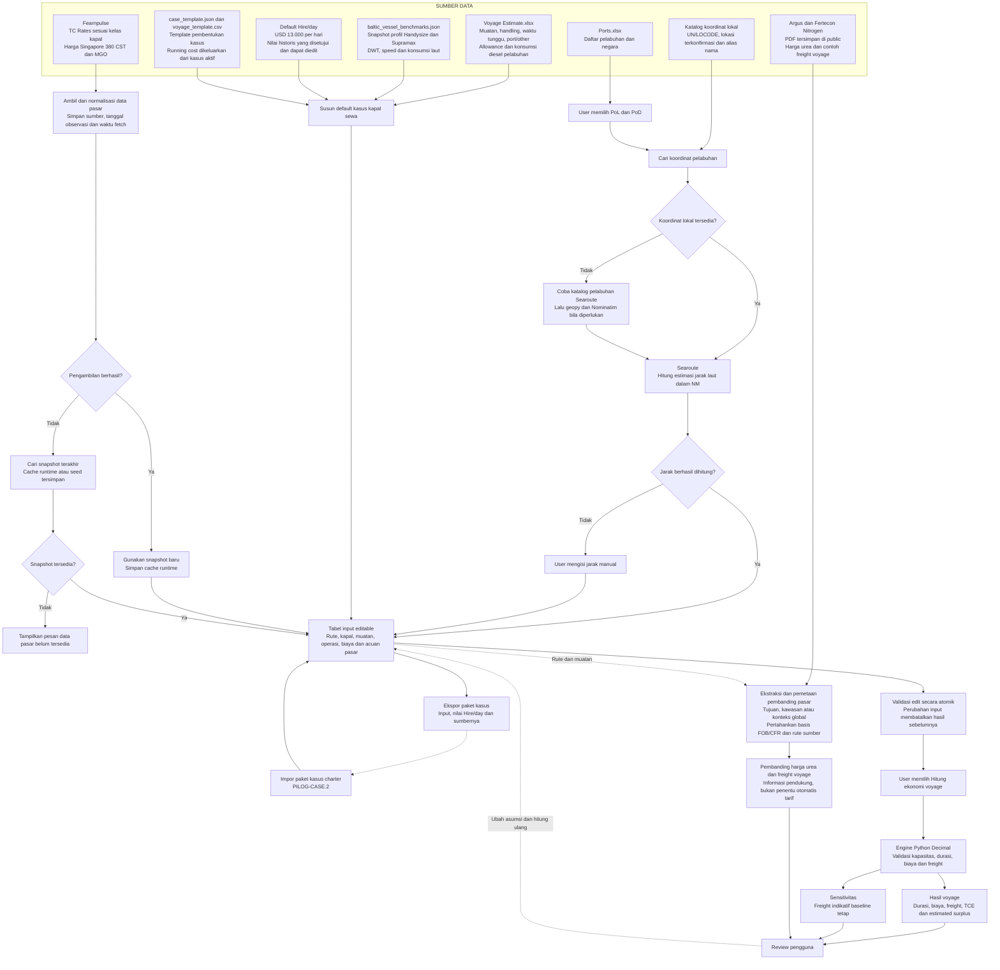
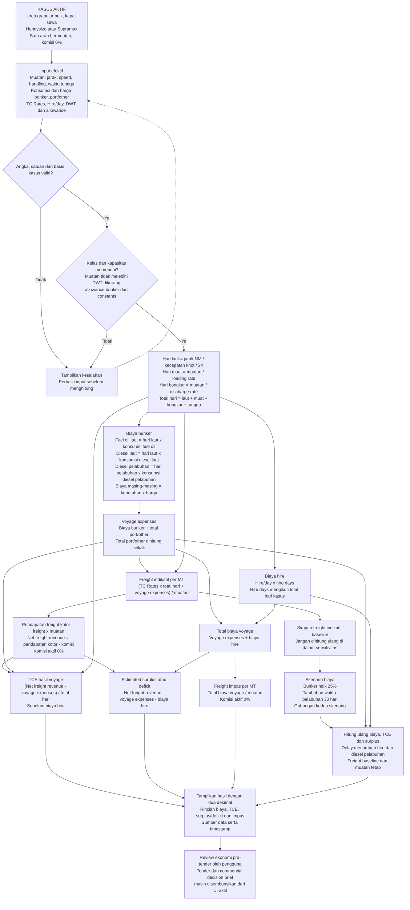

```mermaid
flowchart TB
    subgraph S["SUMBER DATA"]
        S1["Ports.xlsx<br/>Daftar pelabuhan dan negara"]
        S2["Katalog koordinat lokal<br/>UN/LOCODE, lokasi terkonfirmasi dan alias nama"]
        S3["Voyage Estimate.xlsx<br/>Muatan, handling, waktu tunggu, port/other<br/>Allowance dan konsumsi diesel pelabuhan"]
        S4["baltic_vessel_benchmarks.json<br/>Snapshot profil Handysize dan Supramax<br/>DWT, speed dan konsumsi laut"]
        S5["Fearnpulse<br/>TC Rates sesuai kelas kapal<br/>Harga Singapore 380 CST dan MGO"]
        S6["Default Hire/day<br/>USD 13.000 per hari<br/>Nilai historis yang disetujui dan dapat diedit"]
        S7["Argus dan Fertecon Nitrogen<br/>PDF tersimpan di public<br/>Harga urea dan contoh freight voyage"]
        S8["case_template.json dan voyage_template.csv<br/>Template pembentukan kasus<br/>Running cost dikeluarkan dari kasus aktif"]
    end

    S1 --> P1["User memilih PoL dan PoD"]
    S2 --> P2["Cari koordinat pelabuhan"]
    P1 --> P2
    P2 --> P3{"Koordinat lokal tersedia?"}
    P3 -->|Ya| P6["Searoute<br/>Hitung estimasi jarak laut dalam NM"]
    P3 -->|Tidak| P4["Coba katalog pelabuhan Searoute<br/>Lalu geopy dan Nominatim bila diperlukan"]
    P4 --> P6
    P6 --> P7{"Jarak berhasil dihitung?"}
    P7 -->|Tidak| P8["User mengisi jarak manual"]

    S5 --> M1["Ambil dan normalisasi data pasar<br/>Simpan sumber, tanggal observasi dan waktu fetch"]
    M1 --> M2{"Pengambilan berhasil?"}
    M2 -->|Ya| M3["Gunakan snapshot baru<br/>Simpan cache runtime"]
    M2 -->|Tidak| M4["Cari snapshot terakhir<br/>Cache runtime atau seed tersimpan"]
    M4 --> M5{"Snapshot tersedia?"}
    M5 -->|Tidak| M6["Tampilkan pesan data pasar belum tersedia"]

    S3 --> C1["Susun default kasus kapal sewa"]
    S4 --> C1
    S6 --> C1
    S8 --> C1
    P7 -->|Ya| C2["Tabel input editable<br/>Rute, kapal, muatan, operasi, biaya dan acuan pasar"]
    P8 --> C2
    C1 --> C2
    M3 --> C2
    M5 -->|Ya| C2
    C3["Impor paket kasus charter<br/>PILOG-CASE.2"] --> C2
    C2 --> C4["Validasi edit secara atomik<br/>Perubahan input membatalkan hasil sebelumnya"]
    C4 --> C5["User memilih Hitung ekonomi voyage"]
    C5 --> C6["Engine Python Decimal<br/>Validasi kapasitas, durasi, biaya dan freight"]

    S7 --> B1["Ekstraksi dan pemetaan pembanding pasar<br/>Tujuan, kawasan atau konteks global<br/>Pertahankan basis FOB/CFR dan rute sumber"]
    C2 -.->|Rute dan muatan| B1
    C6 --> O1["Hasil voyage<br/>Durasi, biaya, freight, TCE dan estimated surplus"]
    C6 --> O2["Sensitivitas<br/>Freight indikatif baseline tetap"]
    B1 --> O3["Pembanding harga urea dan freight voyage<br/>Informasi pendukung, bukan penentu otomatis tarif"]
    O1 --> O4["Review pengguna"]
    O2 --> O4
    O3 --> O4
    C2 --> O5["Ekspor paket kasus<br/>Input, nilai Hire/day dan sumbernya"]
    O5 -.-> C3
    O4 -.->|Ubah asumsi dan hitung ulang| C2
```

```mermaid
flowchart TB
    A["KASUS AKTIF<br/>Urea granular bulk, kapal sewa<br/>Handysize atau Supramax<br/>Satu arah bermuatan, komisi 0%"]
    A --> B["Input efektif<br/>Muatan, jarak, speed, handling, waktu tunggu<br/>Konsumsi dan harga bunker, port/other<br/>TC Rates, Hire/day, DWT dan allowance"]
    B --> C{"Angka, satuan dan basis kasus valid?"}
    C -->|Tidak| X["Tampilkan kesalahan<br/>Perbaiki input sebelum menghitung"]
    C -->|Ya| D{"Kelas dan kapasitas memenuhi?<br/>Muatan tidak melebihi DWT dikurangi<br/>allowance bunker dan constants"}
    D -->|Tidak| X
    X -.-> B

    D -->|Ya| E["Hari laut = jarak NM / kecepatan knot / 24<br/>Hari muat = muatan / loading rate<br/>Hari bongkar = muatan / discharge rate<br/>Total hari = laut + muat + bongkar + tunggu"]
    E --> F["Biaya bunker<br/>Fuel oil laut = hari laut x konsumsi fuel oil<br/>Diesel laut = hari laut x konsumsi diesel laut<br/>Diesel pelabuhan = hari pelabuhan x konsumsi diesel pelabuhan<br/>Biaya masing-masing = kebutuhan x harga"]
    F --> G["Voyage expenses<br/>Biaya bunker + total port/other<br/>Total port/other dihitung sekali"]

    E --> H["Biaya hire<br/>Hire/day x hire days<br/>Hire days mengikuti total hari kasus"]
    G --> I["Freight indikatif per MT<br/>(TC Rates x total hari + voyage expenses) / muatan"]
    E --> I
    I --> J["Pendapatan freight kotor = freight x muatan<br/>Net freight revenue = pendapatan kotor - komisi<br/>Komisi aktif 0%"]

    G --> K["Total biaya voyage<br/>Voyage expenses + biaya hire"]
    H --> K
    J --> L["TCE hasil voyage<br/>(Net freight revenue - voyage expenses) / total hari<br/>Sebelum biaya hire"]
    G --> L
    E --> L
    J --> M["Estimated surplus atau deficit<br/>Net freight revenue - voyage expenses - biaya hire"]
    K --> M
    K --> N["Freight impas per MT<br/>Total biaya voyage / muatan<br/>Komisi aktif 0%"]

    I --> Q["Simpan freight indikatif baseline<br/>Jangan dihitung ulang di dalam sensitivitas"]
    Q --> R["Skenario biaya<br/>Bunker naik 25%<br/>Tambahan waktu pelabuhan 30 hari<br/>Gabungan kedua skenario"]
    R --> T["Hitung ulang biaya, TCE dan surplus<br/>Delay menambah hire dan diesel pelabuhan<br/>Freight baseline dan muatan tetap"]
    G --> T
    H --> T

    L --> V["Tampilkan hasil dengan dua desimal<br/>Rincian biaya, TCE, surplus/deficit dan impas<br/>Sumber data serta timestamp"]
    M --> V
    N --> V
    T --> V
    V --> W["Review ekonomi pra-tender oleh pengguna<br/>Tender dan commercial decision brief<br/>masih disembunyikan dari UI aktif"]
```
